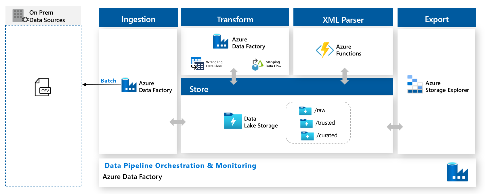

# CSV to XML with Azure Data Factory

In this workshop you will learn how to create a data pipeline using Azure Data Factory to consume a CSV file, transform it using low code and export this data in a XML file using Azure Functions.

 

**Content**

<!-- TOC -->

- [CSV to XML with Azure Data Factory](#csv-to-xml-with-azure-data-factory)
  - [Document Structure](#document-structure)
  - [Prerequisites](#prerequisites)
  - [Services Userd](#services-userd)
  - [Lab Guide](#lab-guide)
    - [Use Case](#use-case)
    - [Proposed Architecture](#proposed-architecture)
    - [Lab 1: Ingest the CSV to the datalake](#lab-1-ingest-the-csv-to-the-datalake)
    - [Lab 2: Transform the data with low code](#lab-2-transform-the-data-with-low-code)
    - [Lab 3: Create the hierarchy to generate a JSON](#lab-3-create-the-hierarchy-to-generate-a-json)
    - [Lab 4: Convert the JSON to XML](#lab-4-convert-the-json-to-xml)

<!-- /TOC -->

## Document Structure

This document contains detailed step-by-step instructions on how to implement a data pipeline to transform and export a csv file to a xml. It’s recommended to you carefully read the detailed description contained in this document for a successful experience with all Azure services.

You will see the label **IMPORTANT** whenever there is a critical step to the lab. Please pay close attention to the instructions given.

For each lab it will be required you to create some resources (Azure Storage, Azure Data Factory, etc.) in your Azure Subscription. For do so, it will be expected your create the resource manually (it won`t be provided templates or script to create the services automatically). To help you it will be added in each lab the documentations that could be useful to do that.

## Prerequisites
The following prerequisites must be completed before you start these labs:

* You must be connected to the internet;

* Use either Edge or Chrome when executing the labs. Internet Explorer may have issues when rendering the UI for specific Azure services.

* You must have a Pay-As-You-Go Azure account with administrator - or contributor-level access to your subscription. If you don't have an account, you can sign up for an account following the instructions here: https://azure.microsoft.com/en-au/pricing/purchase-options/pay-as-you-go/.

     **IMPORTANT**: Azure free subscriptions have quota restrictions that prevent the workshop resources from being create successfully. Please use a Pay-As-You-Go subscription instead.

     **IMPORTANT**: When you create the lab resources in your own subscription you are responsible for the charges related to the use of the services provisioned. For more information about the list of services and tips on how to save money when executing these labs, please visit the [Azure Cost Management Documentation](https://docs.microsoft.com/en-us/azure/cost-management-billing/cost-management-billing-overview#:~:text=%20Understand%20Azure%20Cost%20Management%20%201%20Plan,the%20Azure%20Cost%20Management%20%20Billing...%20More%20).

* Please create the resources in a separated Resource Group.

## Services Userd
| Service                     | Documentation                                                              |
|-----------------------------|---------------------------------------------------------------------------|
| Azure Storage         | https://docs.microsoft.com/pt-br/azure/storage/blobs/                     |
| Azure Data Factory | https://docs.microsoft.com/pt-br/azure/data-factory/ |
| Azure Functions   | https://docs.microsoft.com/en-us/azure/azure-functions/           

 

## Lab Guide

Throughout a series of four labs you will progressively implement a solution for the use case problem presented below.

### Use Case

Our custumer Contoso have just bought a new application system, and the IT teamm will have to send data from the Data Lake every three months. The first issue is the application don't connect directly to the Data Lake and besides that, the only kind of data this application acept is the XML format. The second issue is the IT team from Contoso are not proficient in any programming language to do this conversion and the business team would like to check if the data from the data lake is ok, and do some transformation at the data when necessary, they are not proficient in any programming language as well. They need a user friendly front end to download the XML file to send to the application in the first moment, but in the future, they would like to send automatically.

### Proposed Architecture 

By the end of the workshop you will have implemented the lab architecture referenced below:

1. The csv data that is used in transformations will be sent to Azure through Azure Data Factory.
2. For the transformation, Azure Data Factory Power Query will be used, a user friendly tool very similar to Excel.
4. To convert the data into XML, a Python function will be used through Azure Functions.
5. To orchestrate this entire process, Azure Data Factory will be used.
And to store the data, both raw and final XML, Data Lake Storage will be used. 

### [Lab 1: Ingest the CSV to the datalake](labs/lab-1/Lab1.md)

In this lab you will create a data lake and ingest it data from a on premises source with Azure Data Factory.

The estimated time to complete this lab is: **xx minutes**

### [Lab 2: Transform the data with low code](labs/lab-2/Lab2.md)

In this lab you will transform the data with low code using wrangling data flow (Power Query) at Azure Data Factory.

### [Lab 3: Create the hierarchy to generate a JSON](labs/lab-3/Lab3.md)

In this lab you will create all the hierarchy of the data usign mapping data flow at Azure Data Factory.

### [Lab 4: Convert the JSON to XML](labs/lab-4/Lab4.md)

In this lab you will create an Azure Function generic to convert any JSON to XML file.

 
 
